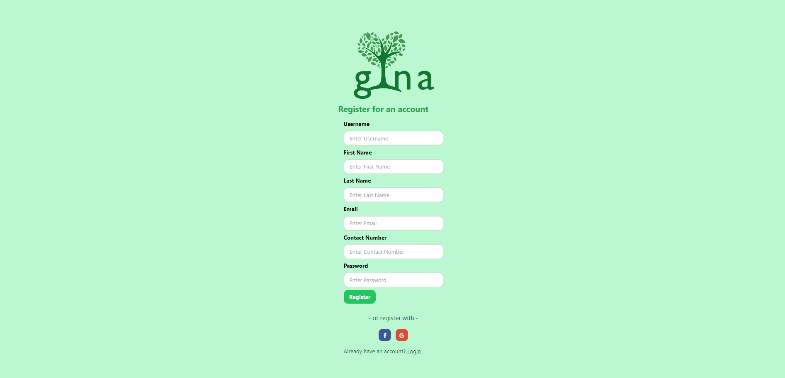
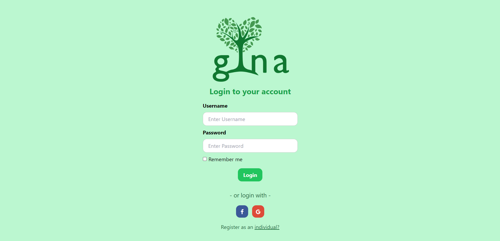
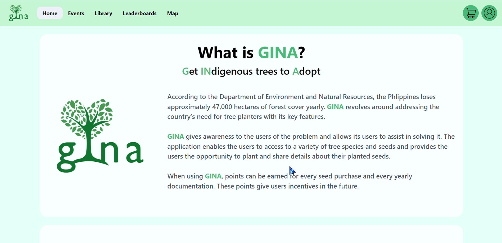
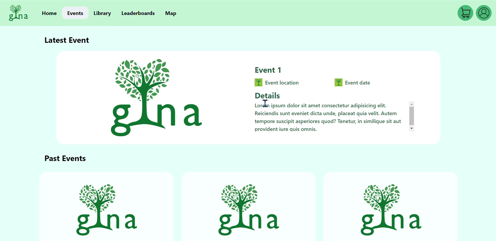
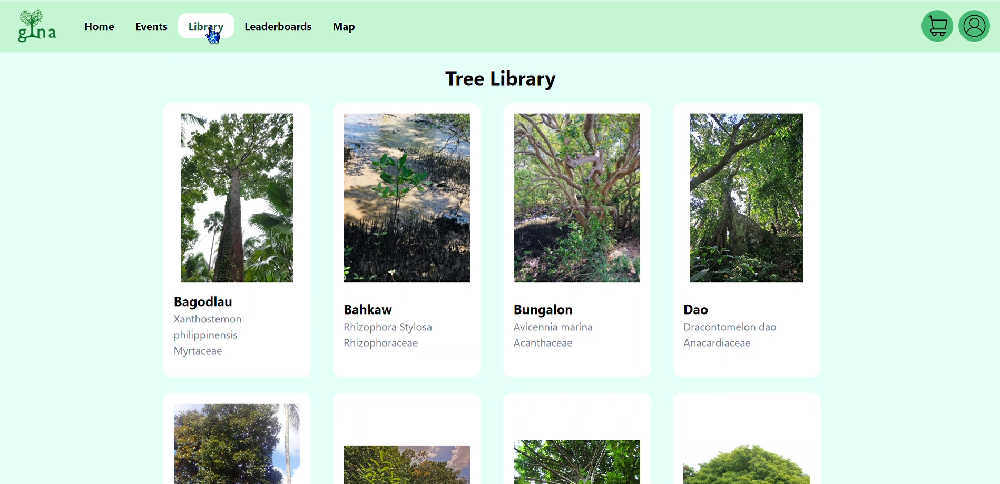
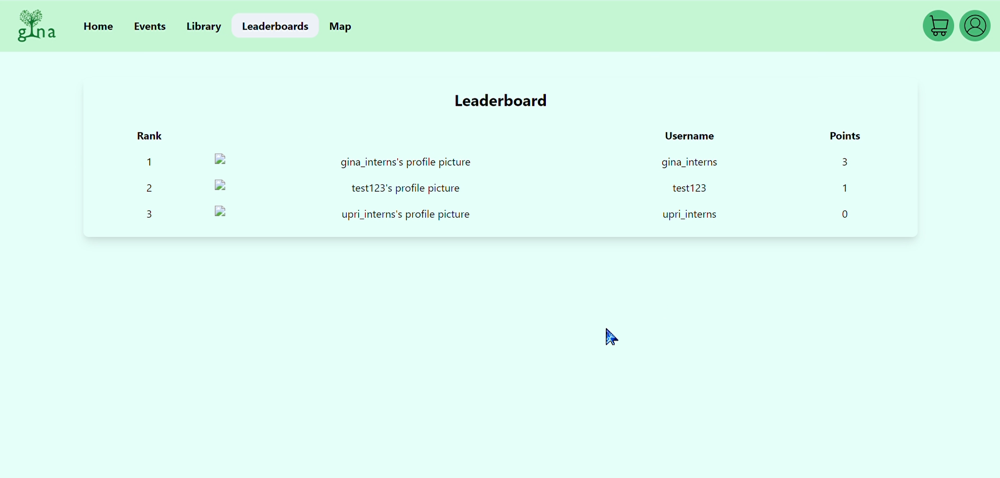
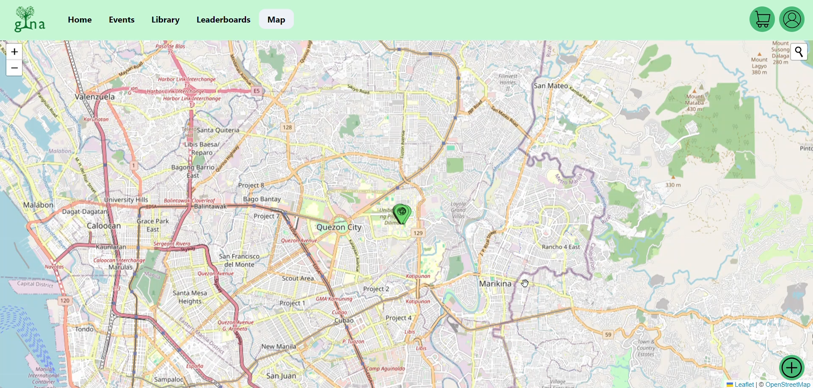

# GINA - **G**row **In**digenous Trees **A**pp

## Overview

This project is an app intended to encourage Filipinos to plant saplings indigenous to the country. 

It aims to provide the following services to users:
- Provide a shop from which to order tree saplings
- Educate users on the needs and care of their chosen trees
- Coordinate the setting of tree-planting events
- Track the status and location of planted trees
- Incentivize users through a points system and scoreboard

## Framework Used

This project was built with a **Django** backend (via Django REST Framework, supplemented with Djoser for user authentication endpoints) and an **HTML-CSS-JS** Frontend, with communication between the two facilitated via **AJAX**. The database was built using **PostGIS**. The API Documentation is generated using **drf-spectacular**.

# Setup

## Prerequisites

This project requires
- [`pyenv`](https://github.com/pyenv/pyenv) == 2.4.7
- [`pipenv`](https://github.com/pypa/pipenv) == 2024.0.1
- [`postgis`](https://github.com/postgis/postgis) == 3.4
- [`postgresql`](https://www.postgresql.org) == 16.3

This project uses Python 3.9. The Python version should be automatically managed by `pyenv` via the `.python-version` file herein. Similarly, all Python packages are managed by `pipenv` using the `Pipfile` herein.

## Local Installation

The frontend and backend are separate systems, though both can be found in this repository.

## Frontend

First, establish a connection with the backend by replacing the **url** in the .js files with the corresponding backend connection.

These .js files makes use of certain endpoints to make the system work:
- signup.js
    - `/auth/users/`     
        - used for registering the user to the database
    - `/api/user-info/`  
        - used for storing other details (such as name and contact number) from the user to the database
- login.js
    - `/auth/token/login/` 
        - used for logging in to the backend and to receive an authentication token
- leaderboard.js
    - `/api/user-info/`  
        - used to query each user's points to display them on the leaderboard
- map.js
    - `/api/user-tree-info/`  
        - used for querying planted trees and displaying them on the map through pins (blue pin = owned, green pin = not owned)
        - used for uploading new trees along with the planting details (such as location and date planted)
    - `/api/user-info/${username}/?format=json`
        - used for updating the points of the user each time a tree is planted

### Backend

Before the backend API can be set up, ensure that a PostgreSQL database instance is running and accessible and provide the following in a `.env` file:

```env
DB_NAME
DB_USER
DB_PASSWORD
DB_PORT
DB_HOST
```

Then, make the migrations via

```bash
python manage.py makemigrations gina
```

Afterwards, execute the migrations via

```bash
python manage.py migrate gina
```

Finally, run the server using

```bash
python manage.py runserver [port]
```

## API Documentation

Once installed and running, an API schema is available via the `/api/schema` endpoint in YAML format. It is also available in human-readable form via `/api/schema/swagger-ui`.

# Usage

## Preliminary Data

Some data for `TreeInfo` and `UserTree` are availble in `api/gina/treeinfo.csv` and `api/gina/usertree.csv`, respectively. The necessary images corresponding to these data can be found in [here](https://drive.google.com/drive/folders/1aYAQ2Zn9Vh8ecuGZkpMRnL5CQhvvfar-), to be added to `api/gina/trees` and `api/gina/usertrees`.

Import the `TreeInfo` data via

```bash
python manage.py runscript api.gina.import_tree_info.py
```

Then import the `UserTree` data via

```bash
python manage.py runscript api.gina.import_usertree.py
```

<!-- TODO: document usage -->

# Screenshots

### Registration Page
- This is where users can register for an account


### Login Page
- This is where users can login after registering for an account


### Landing Page
- This is where users are redirected to after logging in
- It contains information regarding GINA and some plant care tips


### Events Page
- This is where events and articles will be located


### Tree Library Page
- This is where the collection of indigenous trees information is located


### Leaderboards Page
- This is where the ranking of the users based on trees planted can be seen


### Map Page
- This is where the users can see the planted trees as well as upload the trees that they planted

